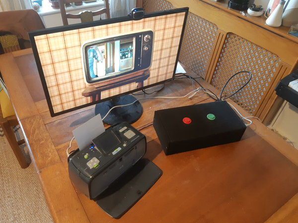
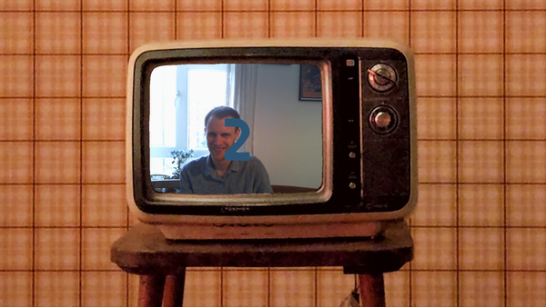
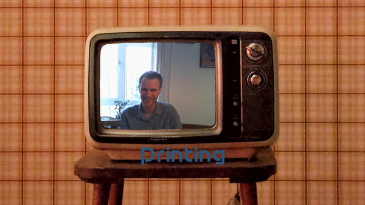
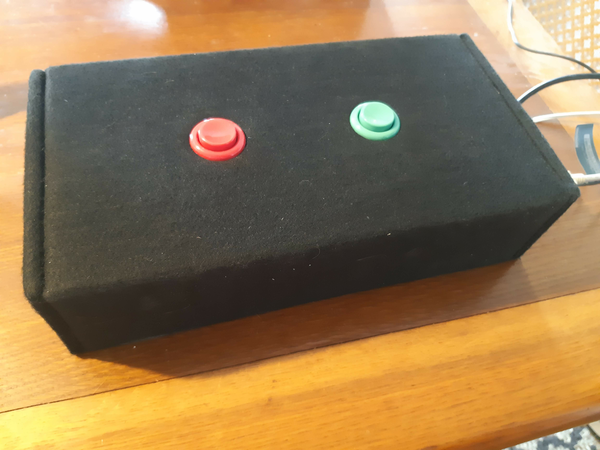
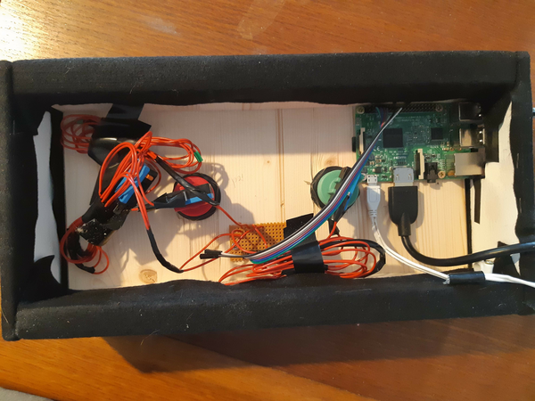

# Photobooth for Raspberry Pi

Super simple Photobooth for Raspberry Pi, controlled by hardware buttons.
 
[](https://travis-ci.org/SimonStJG/rpi-photobooth)

Features:

* Smooth live camera preview 
* Printing via libcups 
* Minimal dependencies
  * Nothing but Qt5, Qt5-Multimedia, cups and their respective Python bindings.
* Option to mirror the camera left to right
* Easy to switch out the background 
* Mostly works

If you'd like to see what sort of configurations are configurable, take a look
 at [the config](default-config.cfg).

> (Yes, you can use a keyboard if you really want, but it's designed for 
> buttons - you definitely can't use a mouse!  And yes it will probably 
> actually work on any Debian, or indeed any Linux distro if you can track 
> down the right Qt5 dependencies and install libcups.) 
 
# Pictures

Here's my setup:



Some screenshots:







And here's some pics of the brains, from the top:



And the inside:



# Installation

1. On any Debian-based distro, including Raspbian on Raspberry Pi:
    ```
    sudo apt install \
        cups \
        python3-pyqt5 \
        python3-pyqt5.qtmultimedia \
        python3-cups \
        libqt5multimedia5 \
        libqt5multimedia5-plugins
    ```
    
    > (It is tempting as it is to use a proper python package manager like Pip,
    or even Poetry, but we want to avoid building PyQt5 as it takes forever on a 
    Raspberry Pi.  And if you don't get all the dependencies installed for 
    QtMultimedia, PyQt5 will still build properly - but then QtMultimedia will 
    just not work at all and no-ones got time for that.) 

2. Take a copy of `default-config.cfg` and update it as needed.

3. Run it:
    ```
    python3 -m photobooth --config my-config.cfg
    ```

# Development

Look at config options `useMockGpioZero` and `useMockPrinter` for testing on a 
device which isn't a Raspberry Pi.

### Code style

Install linting tools with `pip install -r ./dev-requirements.txt` and run linting 
checks with `./checks.sh`.

You can auto-format the code with `./auto-format.sh` too.

# Thanks

Design by my friend [Jess](https://jesslindenwhite.carbonmade.com/about).

I was inspired by [Reuterbal's photobooth](
https://github.com/reuterbal/photobooth) - and to be honest I'd recommend his 
over mine in almost every case - but I do enjoy building things from scratch, 
so..
 
# License

Code licensed under GPL v3, See [LICENSE.txt](LICENSE.txt)

# TODO 

* Unable to take a fresh picture without a workaround of unloading and 
  reloading the QCamera, see TODO note in `live_feed_widget.py`
* While there is error handling for printer errors, it could be better - for
  example we don't detect properly if:
  * The printer has run out of paper
  * Someone has pressed cancel on the printer
  * Probably a wealth of other errors
* Log to a file rather than stdout
* Restart on all errors after a certain time

# Troubleshooting

* If you see are seeing errors to do with the camera, first stop is to enable 
 gstreamer debug logs - this is done using the `GST_DEBUG` environment 
 variable, e.g. 
  `GST_DEBUG='*:4' python -m photobooth ..`  enables INFO logs.

# Personal notes 

(Some notes specific for my personal setup)

1. Install HP printer drivers via `sudo apt install hplip` - don't install 
via the script on HPs website!  It will try to pull in all sorts of rubbish.
2. Add the printer via cups in the usual way, i.e. http://localhost:631 and 
choose driver `HP Photosmart a610, hpcups 3.18.12 (color)`.
  * If you get a permissions error when adding a printer as the `pi` user, you
    might be missing from the `lpadmin` group, run
    `sudo usermod -a -G lpadmin pi`.
3. Copy over the .desktop file into the `~/.config/autostart`
folder - this adds an icon in the applications menu.
4. Copy over the systemd service, reload, enable, and start it:
```
sudo cp photobooth.service /lib/systemd/system
sudo systemctl daemon-reload
sudo systemctl enable photobooth
sudo systemctl start photobooth
```
This runs the Photobooth on startup and restarts it if it terminates.
 * If it doesn't start, debug in the usual way for systemd services (
`sudo journalctl -xe` will get you some logs).
